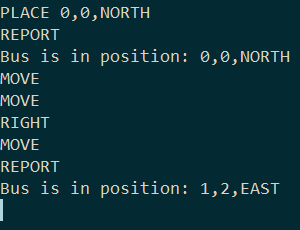

## ES6 Functional Bus
This is an ES6 functional coding test to build an interactive shell with the specifications detailed below.

## Installation & Use
- Ensure you have node installed and added to your PATH (https://nodejs.org/en/)
- run `npm install`
- run `npm test` to execute unit tests
- coverage can be viewed with `npm run coverage`
- run `node run.js` to open an interactive shell

### Task Description:

#### Bus in Carpark Simulator

We use this test as an indication of the kind of code that a candidate would write on a day to
day basis, so please take your time and submit representative code.
Using JavaScript, design and code up a Bus in Carpark Simulator. You might want to include
unit tests.
Host your code on bitbucket or GitHub and send in your repo URL for review. When setting
up the repo, structure it such that it will be used as a working repo in the future. You should
aim to deliver production ready code, and your repository should be structured as you would
if you were setting up a real repository.

#### Description
- The application is a simulation of a robot operated bus moving in a carpark, of
dimensions 5 units x 5 units.
- There are no other obstructions in the carpark.
- The bus is free to roam around the carpark, but must be prevented from exiting the
carpark. Any movement that would result in the bus leaving the carpark must be
prevented, however further valid movement commands must still be allowed.
The application should be able to read in any one of the following commands:
- - PLACE X,Y,F
- - MOVE
- - LEFT
- - RIGHT
- - REPORT

- PLACE will put the bus in the carpark in position X,Y and facing NORTH, SOUTH,
EAST or WEST.
- The origin (0,0) can be considered to be the SOUTH WEST most corner.
- The first valid command to the bus is a PLACE command, after that, any sequence of
commands may be issued, in any order, including another PLACE command. The
application should discard all commands in the sequence until a valid PLACE
command has been executed.
- MOVE will move the bus one unit forward in the direction it is currently facing.
- LEFT and RIGHT will rotate the bus 90 degrees in the specified direction without
changing the position of the bus.
- REPORT will announce the X,Y and F of the bus. This can be in any form, but
standard output is sufficient.
- A bus that is not in the carpark should ignore the MOVE, LEFT, RIGHT and REPORT
commands.
- Input can be from a file, or from standard input, as the developer chooses.
- Provide test data to exercise the application.
Constraints:
- The bus must not exit the carpark during movement. This also includes the initial
placement of the bus.
- Any move that would cause the bus to exit the carpark must be ignored.
Here is some example input and output:

#### Example A)
- PLACE 0,0,NORTH
- MOVE
- REPORT

Output: 0,1,NORTH

#### Example B)
- PLACE 0,0,NORTH
- LEFT
- REPORT

Output: 0,0,WEST

#### Example C)
- PLACE 1,2,EAST
- MOVE
- MOVE
- LEFT
- MOVE
- REPORT

Output: 3,3,NORTH